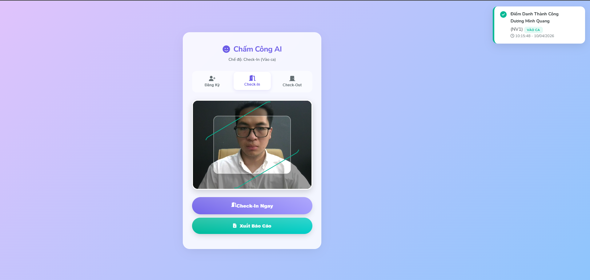
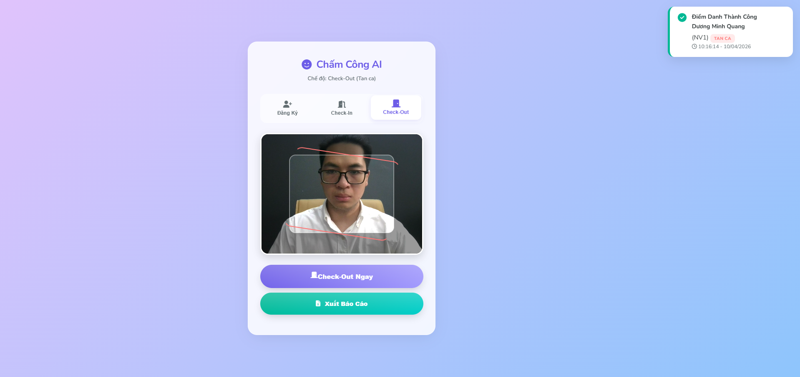
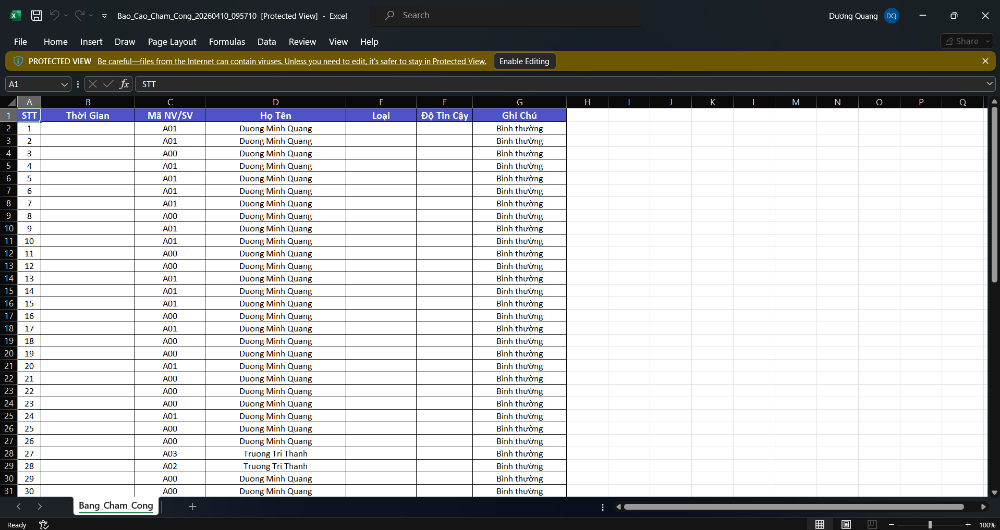

# 🎓 Hệ Thống Chấm Công AI Thông Minh (Face Recognition & Liveness Detection)

[](https://www.python.org/)
[](https://flask.palletsprojects.com/)
[](https://opencv.org/)
[](https://pytorch.org/)
[](LICENSE)

> **Đồ án tốt nghiệp:** Xây dựng hệ thống điểm danh tự động sử dụng nhận diện khuôn mặt, tích hợp chống giả mạo 3D (Anti-Spoofing) và xuất báo cáo thời gian thực.

---

## 🚀 Tính năng nổi bật

- ✅ **Nhận diện khuôn mặt chính xác:** Sử dụng mô hình InsightFace (Buffalo_L) với độ chính xác >95%.
- ✅ **Chống giả mạo 3D (Liveness Detection):** Tự train mô hình CNN trên 4 bộ dataset lớn (CASIA, Replay-Attack, OULU-NPU, SiW) để phát hiện ảnh chụp, video màn hình.
- ✅ **Đa chế độ hoạt động:** Đăng ký người mới, Check-in (vào ca), Check-out (tan ca).
- ✅ **Giao diện Web App hiện đại:** Responsive, chạy mượt mà trên cả máy tính và điện thoại mà không cần cài đặt app.
- ✅ **Xuất báo cáo Excel:** Tự động tạo file báo cáo chấm công chuyên nghiệp, có định dạng màu sắc và thời gian thực.
- ✅ **Hỗ trợ Camera linh hoạt:** Hoạt động với Webcam USB, Laptop và cả Camera IP (RTSP).
- ✅ **Đóng gói Docker:** Sẵn sàng triển khai trên mọi môi trường server.

---

## 🛠️ Công nghệ sử dụng

### Backend & AI
- **Ngôn ngữ:** Python 3.10+
- **Web Framework:** Flask (API Server)
- **Xử lý ảnh:** OpenCV, Pillow
- **Deep Learning:** PyTorch, ONNX Runtime
- **Mô hình AI:** 
  - *Face Recognition:* InsightFace (ArcFace)
  - *Liveness Detection:* Custom CNN (train trên CASIA, OULU, SiW, Replay-Attack)
- **Xử lý dữ liệu:** Pandas, NumPy, Scikit-learn
- **Xuất báo cáo:** OpenPyXL

### Frontend
- **Giao diện:** HTML5, CSS3, JavaScript (Vanilla)
- **Thư viện UI:** Google Fonts (Poppins), FontAwesome (Icons)
- **Camera API:** Navigator MediaDevices

### Hạ tầng & Triển khai
- **Containerization:** Docker & Docker Compose
- **Hệ điều hành:** Windows 10/11, Linux (Ubuntu)
- **Database:** File phẳng (CSV, NPY) - Tối ưu cho quy mô vừa và nhỏ.

---

## 📦 Cài đặt và Hướng dẫn sử dụng

### 1. Yêu cầu hệ thống
- Python 3.8 trở lên (Khuyên dùng Python 3.10).
- RAM tối thiểu 4GB (8GB khuyến nghị để train model).
- Camera (Webcam hoặc IP Camera hỗ trợ RTSP).
- Kết nối Internet (để tải model lần đầu).

### 2. Cài đặt môi trường

**Bước 1: Clone dự án về máy**
```bash
git clone https://github.com/TEN_USER_CUA_BAN/ten-du-an.git
cd ten-du-an
```

**Bước 2: Tạo môi trường ảo (Khuyên dùng)**
```bash
python -m venv venv
# Trên Windows
venv\Scripts\activate
# Trên Linux/Mac
source venv/bin/activate
```

**Bước 3: Cài đặt các thư viện cần thiết**
```bash
pip install -r requirements.txt
```
Lưu ý: Quá trình này có thể mất 5-10 phút do tải các thư viện AI nặng như torch, insightface.

**Bước 4: Cấu hình hệ thống**
#### Mở file src/config.py để cấu hình:
* Camera: Điền link RTSP nếu dùng camera IP, hoặc để None nếu dùng Webcam.
* Telegram (Tùy chọn): Điền TELEGRAM_BOT_TOKEN và TELEGRAM_CHAT_ID nếu muốn nhận thông báo.

### 3. Chạy chương trình

**Cách 1: Chạy trực tiếp (Native Mode) - Khuyên dùng cho Demo**
```bash
python server.py
```
Truy cập trình duyệt tại địa chỉ: http://localhost:5000

**Cách 2: Chạy bằng Docker**
```bash
# Build image
docker build -t face-checkin:v2 .

# Run container
docker run -it --rm -p 5000:5000 -e CAMERA_INDEX=0 face-checkin:v2
```
(Lưu ý: Khi dùng Docker trên Windows, nên dùng Camera IP để tránh lỗi truy cập webcam).

### 4. Hướng dẫn sử dụng Web App
#### 4.1. Đăng ký người mới:
* Chọn tab "Đăng Ký".
* Nhập Mã NV/SV và Họ tên.
* Đưa mặt vào khung hình và bấm "Chụp & Lưu".
#### 4.2. Điểm danh (Check-in/Check-out):
* Chọn tab "Check-In" (Vào ca) hoặc "Check-Out" (Tan ca).
* Đưa mặt vào khung hình, hệ thống tự động kiểm tra thật/giả.
* Nếu thành công, thông báo sẽ hiện ra kèm thời gian thực.
#### 4.3. Xuất báo cáo:
* Nhấn nút "Xuất Báo Cáo Excel".
* File .xlsx sẽ tự động tải về với đầy đủ thông tin, được tô màu và định dạng sẵn.

### ⚠️ Lưu ý quan trọng
#### 1. Ánh sáng: Để đạt độ chính xác cao nhất, hãy đảm bảo ánh sáng đủ sáng, tránh ngược sáng hoặc bóng che khuất khuôn mặt.
#### 2. Lần chạy đầu tiên: Hệ thống sẽ tự động tải model InsightFace (~500MB) về thư mục cache. Vui lòng giữ kết nối Internet ổn định.
#### 3. Camera IP: Nếu sử dụng Camera RTSP bị giật/lag, hãy chuyển sang luồng phụ (Sub-stream) trong đường link (thường đuôi là /102 thay vì /101).
#### 4. Telegram: Nếu không nhận được thông báo, hãy kiểm tra xem bạn đã nhấn START với Bot chưa và Chat ID có chính xác không.
#### 5. Dữ liệu: Dữ liệu người dùng được lưu trong file data.csv và face_embeddings.npy. Hãy sao lưu định kỳ các file này trong thư mục data/.

### 🏆 Kết quả đạt được
#### 1. Về mô hình AI
* Đã huấn luyện thành công mô hình Liveness Detection tùy chỉnh.
* Độ chính xác (Accuracy): Đạt 91.43% trên tập kiểm thử đa dạng (ánh sáng, góc nghiêng).
* Khả năng chống giả mạo: Precision đạt 96.5%, hạn chế tối đa việc chấp nhận ảnh chụp/màn hình.
* Dữ liệu train bao gồm 4 bộ dataset lớn: CASIA-FASD, Replay-Attack, OULU-NPU, SiW.

#### 2. Về hệ thống ứng dụng
* Xây dựng hoàn chỉnh kiến trúc Client-Server (Flask API + Web Client).
* Tích hợp đầy đủ quy trình: Đăng ký -> Nhận diện -> Chống giả mạo -> Ghi log -> Xuất báo cáo.
* Giao diện thân thiện, dễ sử dụng, có thể chạy trên mọi thiết bị có trình duyệt.
* Thời gian xử lý trung bình: 1.5 - 3 giây/lần điểm danh (trên CPU thường).

#### 3. Hình ảnh demo






### 📂 Cấu trúc dự án
```bash
.
├── server.py              # File chạy chính (Flask API)
├── requirements.txt       # Danh sách thư viện
├── Dockerfile             # Cấu hình Docker
├── src/
│   ├── config.py          # File cấu hình hệ thống
│   ├── face_model.py      # Module nhận diện khuôn mặt
│   ├── liveness_check.py  # Module chống giả mạo
│   ├── database.py        # Module quản lý data & đăng ký
│   └── checkin.py         # Module ghi log & xuất báo cáo
├── templates/
│   └── index.html         # Giao diện Web App
├── models/                # Chứa file model AI đã train
├── data/                  # Chứa database người dùng và log
└── datasets/              # Chứa dữ liệu train (không đẩy lên Git)
```

### 👨‍ Tác giả
* Sinh viên thực hiện: Dương Minh Quang
* Giảng viên hướng dẫn: Phạm Hồng Phong
* Trường: Đại học Xây Dựng Hà Nội
* Email: 0218466@huce.edu.vn


